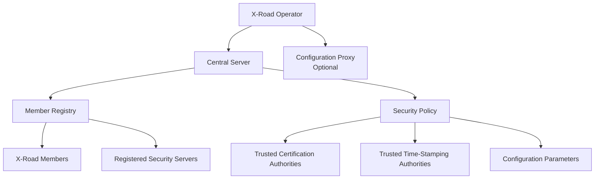
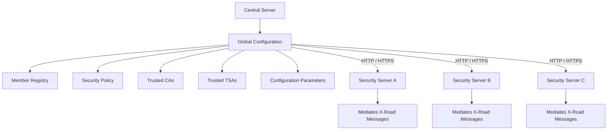
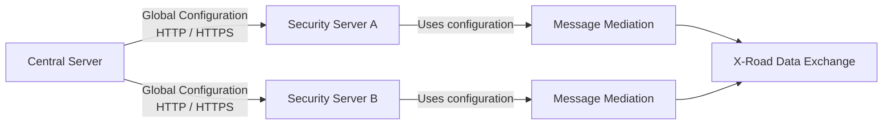
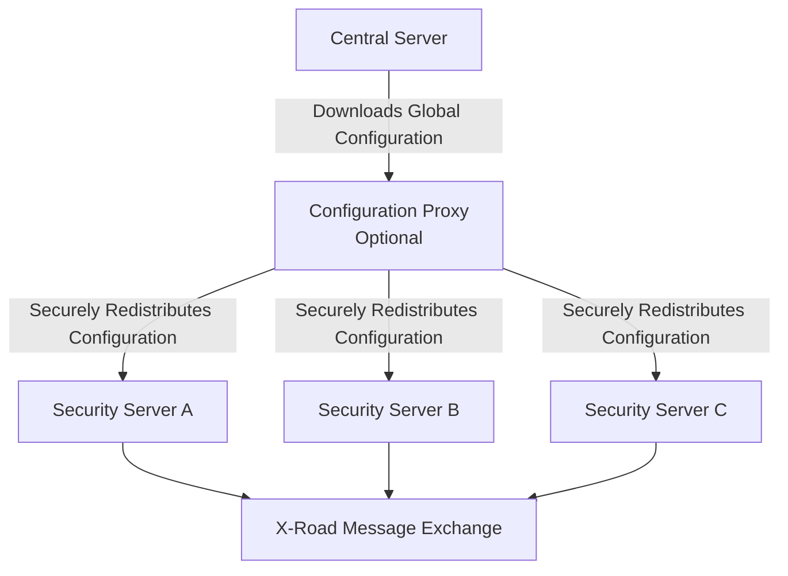
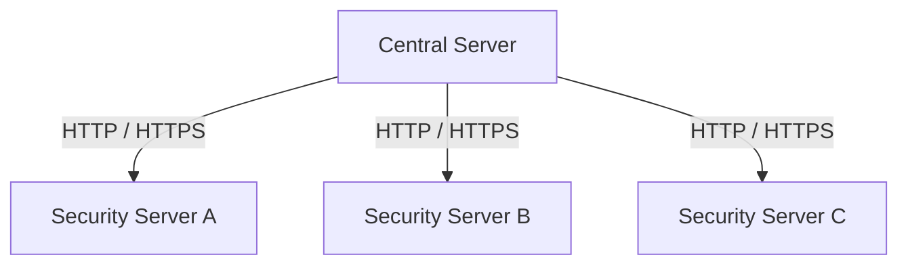
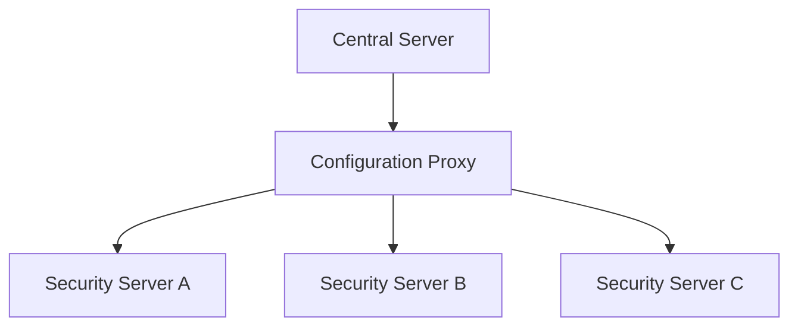
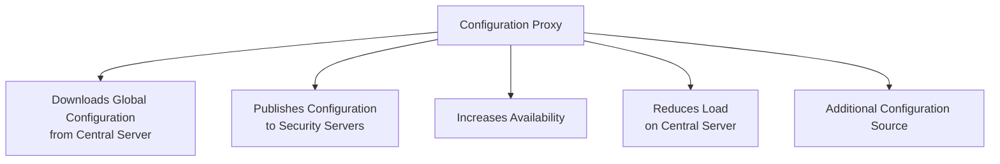
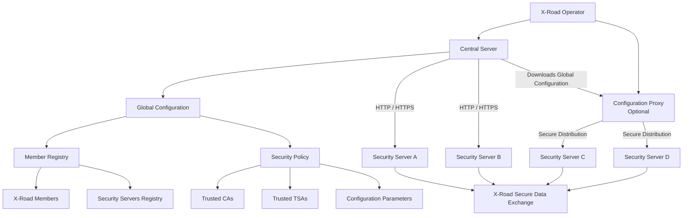

2026-06-22 16:37

Status: #adult 

Tags: [[x-road]]
- - -
# Central Services /  [[X Road - Serviços Centrais]]

Central services consist of Central Server and Configuration Proxy. Central Server contains the registry of X-Road members and their Security Servers. Besides, the Central Server contains the security policy of the X-Road instance that includes a list of trusted certification authorities, a list of trusted time-stamping authorities, and configuration parameters. Both the member registry and the security policy are made available to the Security Servers via HTTP and HTTPS protocols. This distributed set of data forms the global configuration that Security Servers use for mediating the messages sent via X-Road. The X-Road Operator is responsible for operating the Central Server. 

Configuration Proxy is an optional component that can be used as a proxy for publishing the global configuration to Security Servers for download. The Configuration Proxy first downloads the global configuration from the Central Server and then further distributes it securely. The Configuration Proxy can be used to increase system availability by creating an additional configuration source and reduce the load on the Central Server. The X-Road Operator is responsible for operating the Configuration Proxy.

- - - 
## Central Services — Visão geral

---

## Central Server distribuindo configuração global

---

## Security Servers usando a configuração global

---

## Central Server com Configuration Proxy

---

## Sem Configuration Proxy

---

## Com Configuration Proxy

---

## Função do Configuration Proxy

---

## Fluxo completo

O **Central Server** é a fonte principal da configuração global.  
O **Configuration Proxy** é opcional e serve para aumentar disponibilidade e reduzir carga no Central Server.
- - -
# Referências
https://x-road.thinkific.com/courses/take/x-road-service-developer/texts/23560180-architecture