2026-06-22 17:00

Status: #adult 

Tags: [[x-road]]
- - -
# Certification Authority (CA) / [[X Road - Autoridade de Certificação (AC)]]

The certification authority (CA) issues certificates to Security Servers (authentication certificates) and X-Road member organizations (signing certificates). Authentication certificates are used for securing the connection between two Security Servers. Signing certificates are used for digitally signing the messages sent by X-Road members. Only certificates issued by trusted certification authorities that are defined in the Central Server can be used. 

The Security Server checks the validity of the signing and authentication certificates via the Online Certificate Status Protocol (OCSP). Each Security Server is responsible for querying the validity information of its certificates and then sharing the information with other Security Servers as a part of the message exchange process. Only Security Servers with valid signing and authentication certificates can exchange messages with other Security Servers.

- - -

## Certification Authority — Visão geral

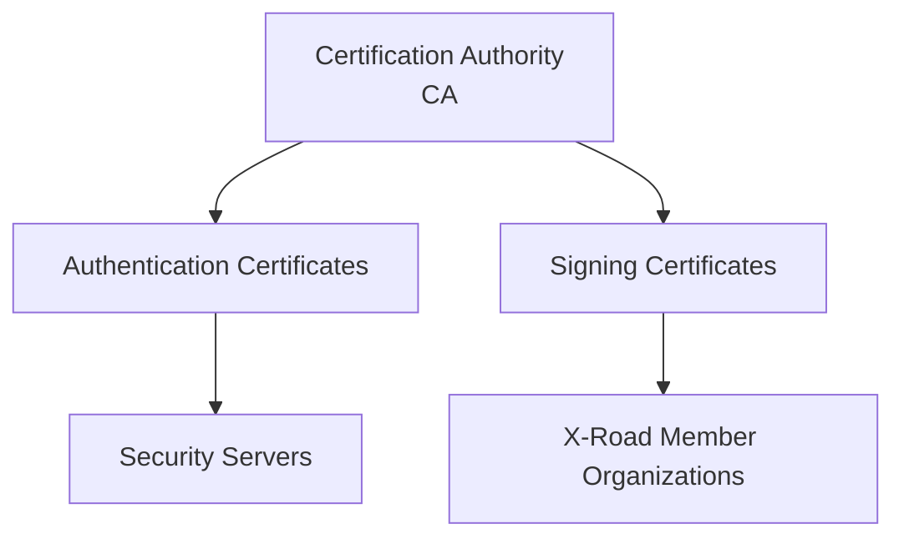

---

## Tipos de certificados

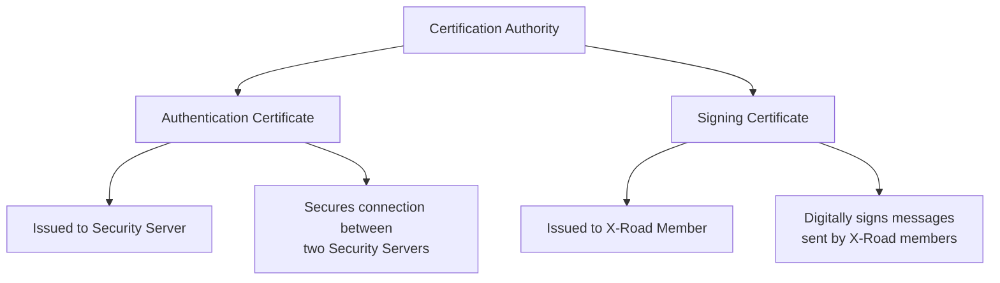

---

## Certificados confiáveis definidos no Central Server

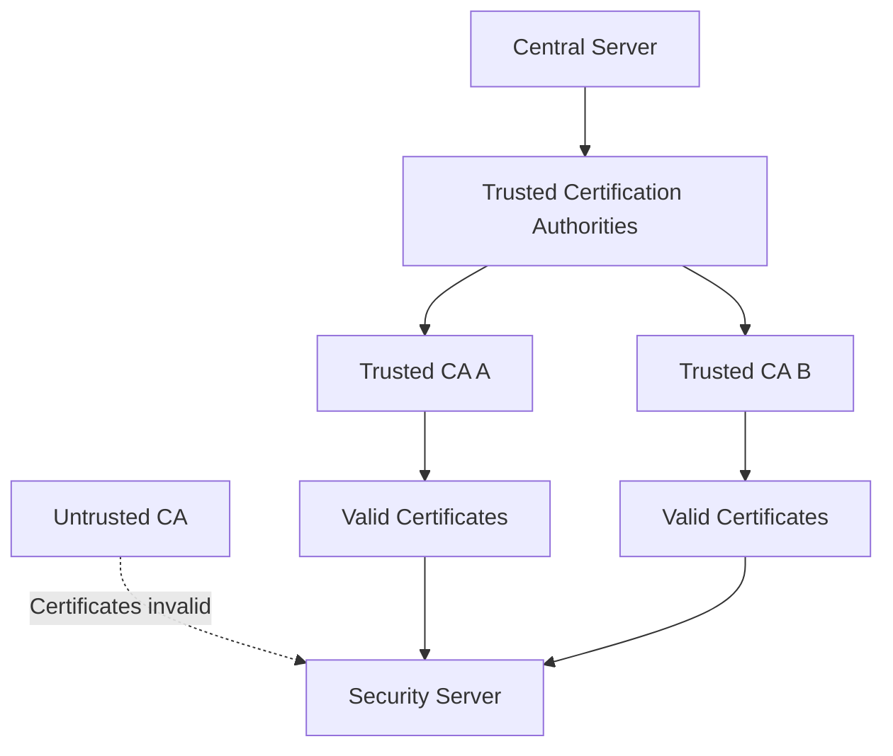

---

## Certificado de autenticação entre Security Servers

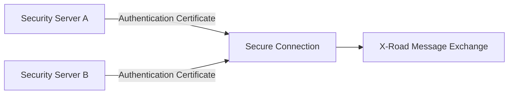

---

## Certificado de assinatura de mensagens

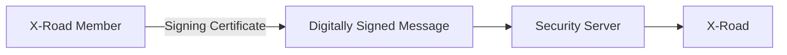

---

## Validação de certificados via OCSP

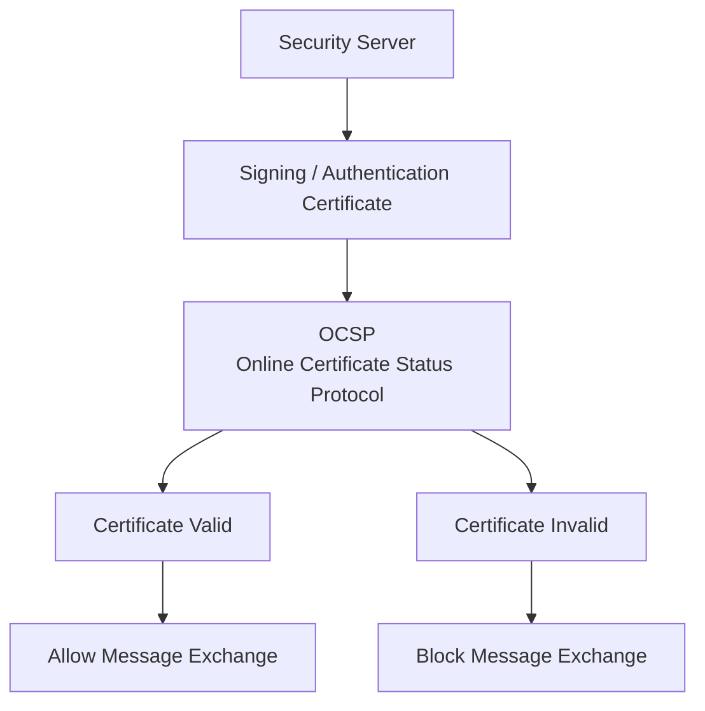

---

## Security Server consultando validade dos certificados

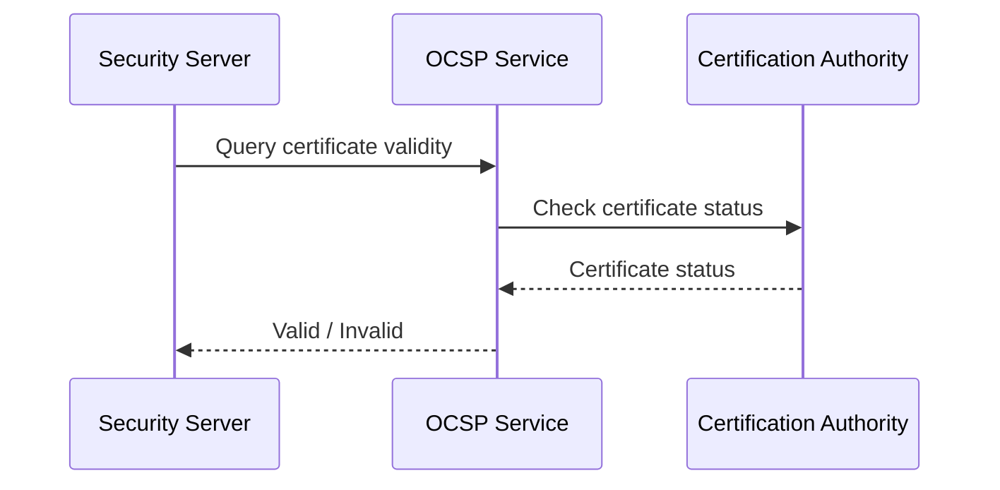

---

## Compartilhamento de validade durante troca de mensagens

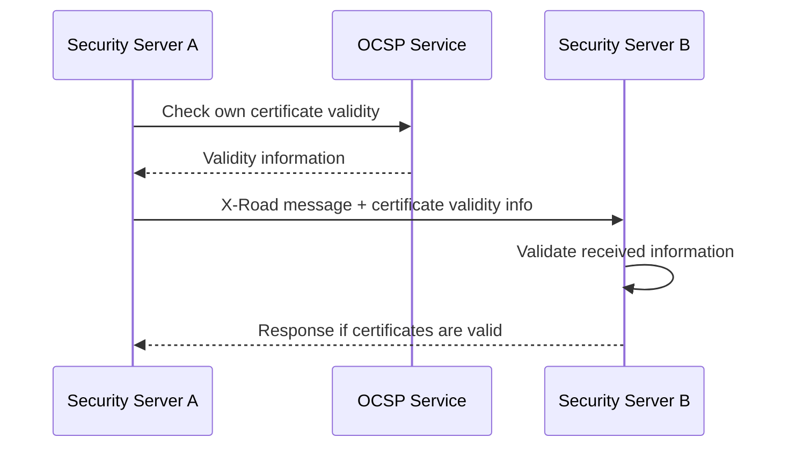

---

## Apenas servidores com certificados válidos trocam mensagens

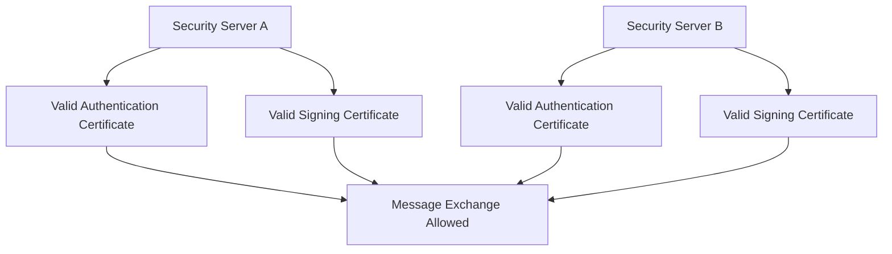

---

## Quando o certificado é inválido

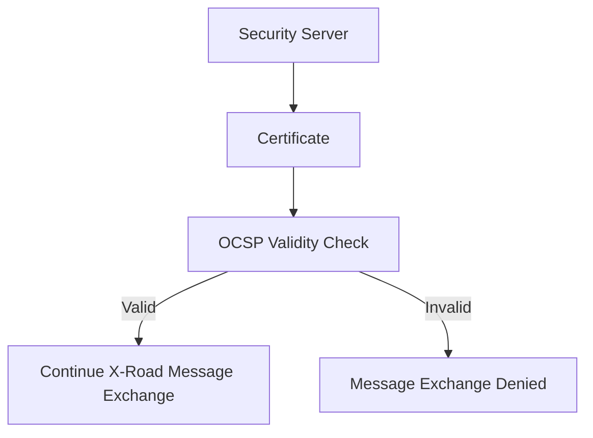

---

## Fluxo completo

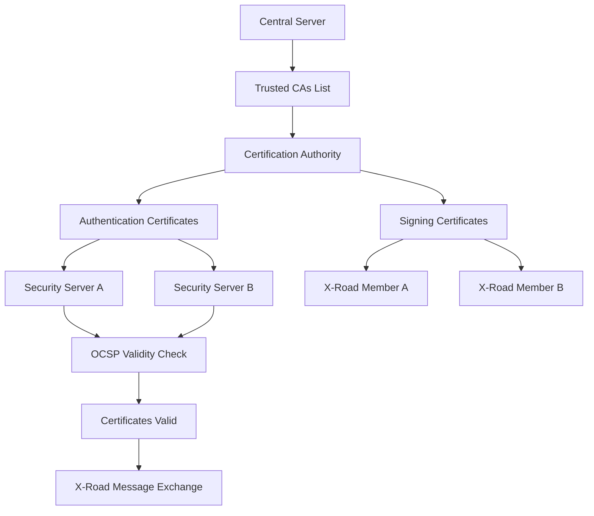

---

## Resumo visual

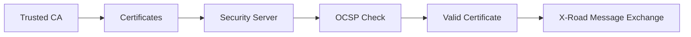
- - -
# Referências
https://x-road.thinkific.com/courses/take/x-road-service-developer/texts/23560180-architecture