2026-06-22 16:44

Status: #adult 

Tags: [[x-road]]
- - -
# Information System / [[X Road - Sistema de Informação]]

The Information System produces and/or consumes services via X-Road and is owned by an X-Road member. X-Road supports consuming and producing both REST and SOAP services. However, X-Road does not provide automatic conversions between different types of messages and services.

For a service consumer Information System, the Security Server acts as an entry point to all the X-Road services. The consumer can discover registered X-Road members and their available services by using the X-Road metadata protocol.

A service provider Information System implements a REST and/or SOAP service and makes it available over the X-Road. Existing REST services do not require any changes – they can be published as-is. Instead, SOAP services must implement the X-Road message protocol for SOAP. Service descriptions of REST services are defined using OpenAPI3 specification, and service descriptions of SOAP services are defined using WSDL. Service consumers can download service descriptions using the X-Road metadata protocol.

- - -
## Information System — Visão geral

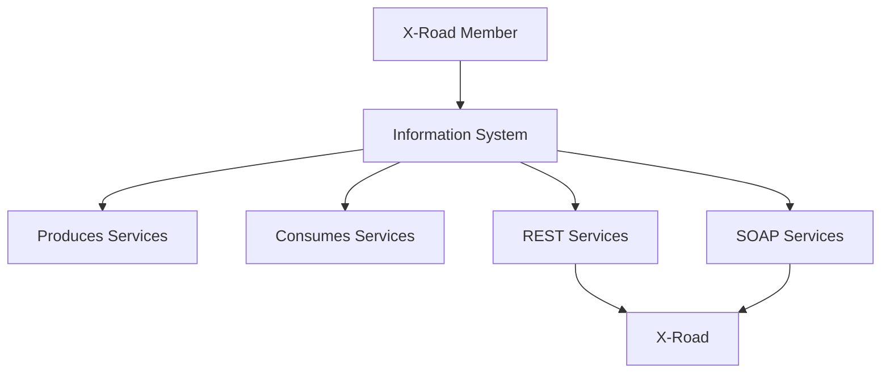

---

## Produção e consumo de serviços

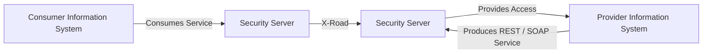

---

## X-Road não converte mensagens automaticamente

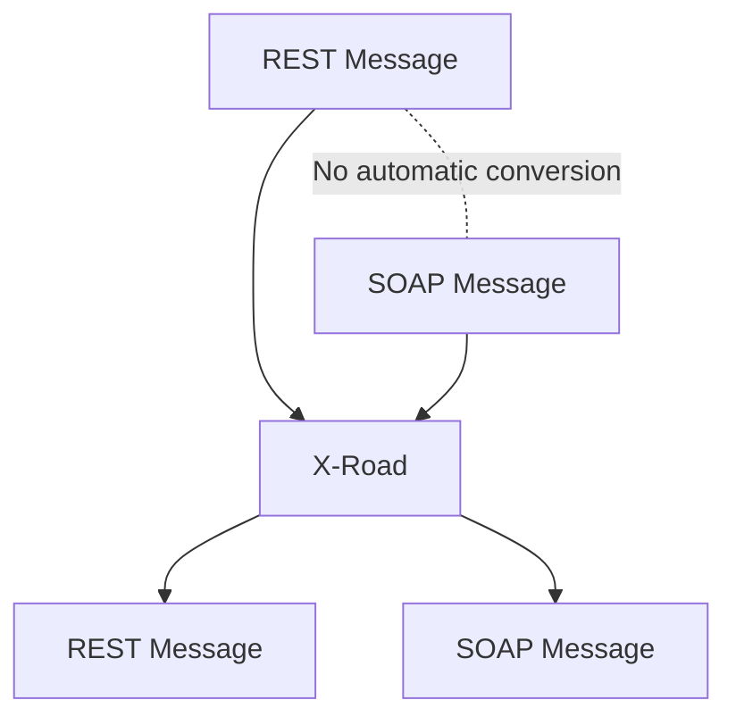

---

## Consumer Information System

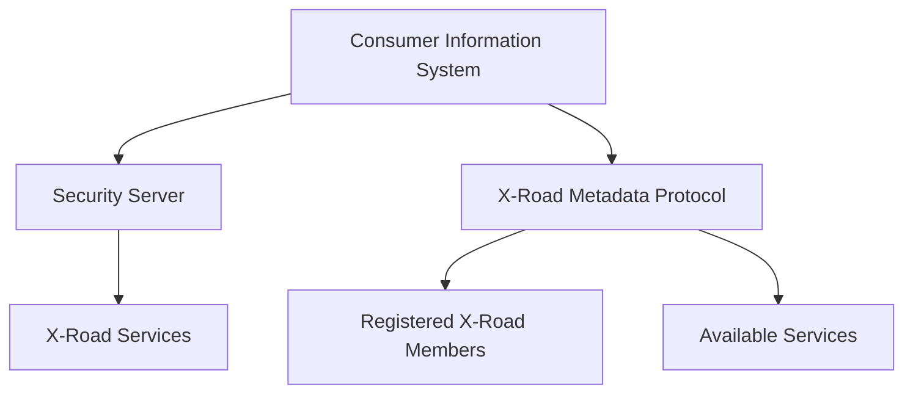

---

## Descoberta de serviços

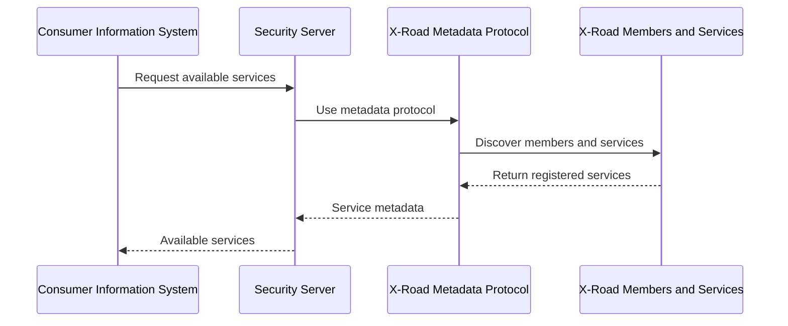

---

## Provider Information System

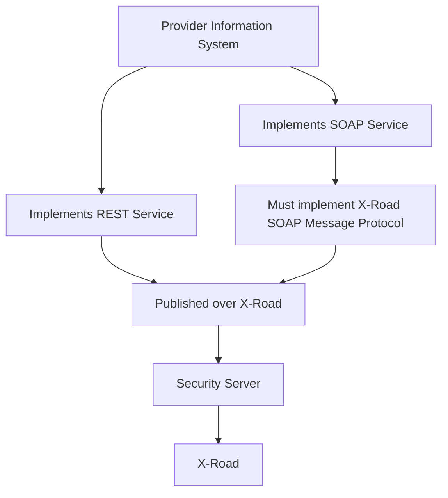

---

## REST Services

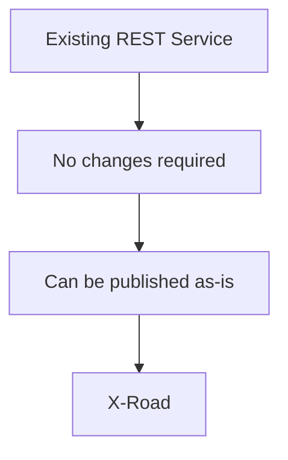

---

## SOAP Services

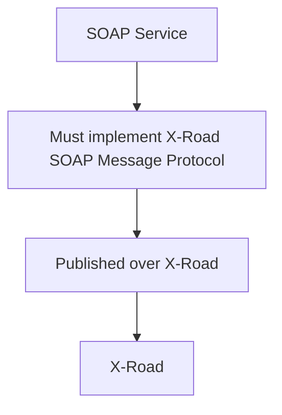

---

## Service descriptions

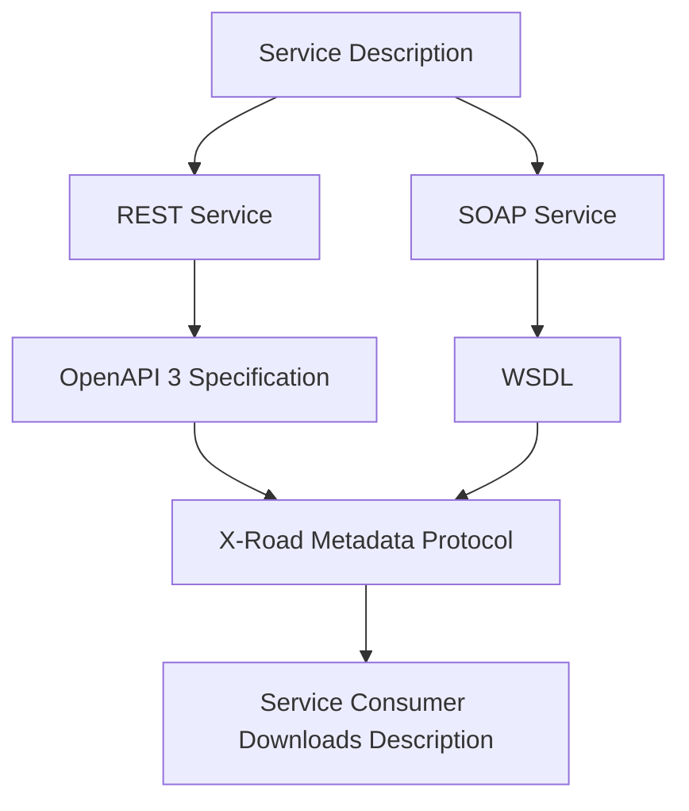

---

## Fluxo completo

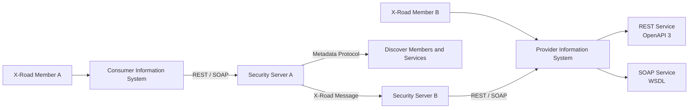

---

## Resumo visual

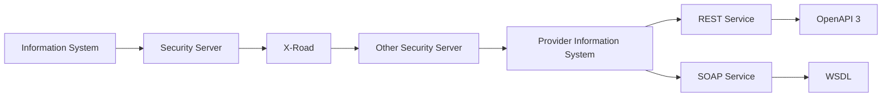

- - -
# Referências
https://x-road.thinkific.com/courses/take/x-road-service-developer/texts/23560180-architecture