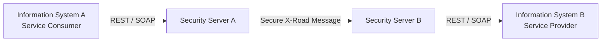
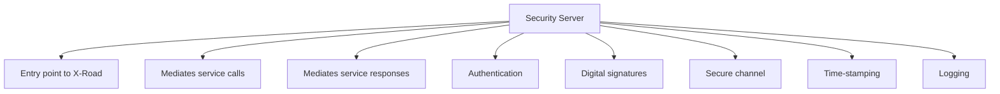
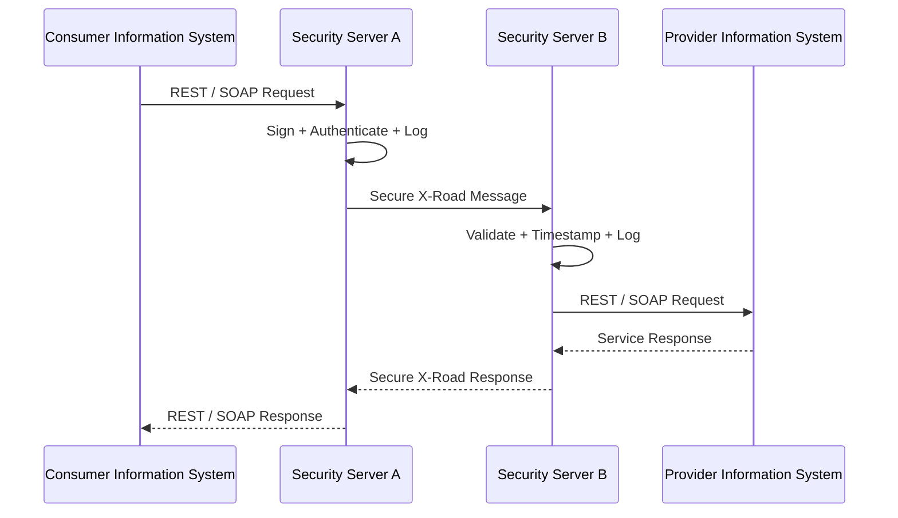
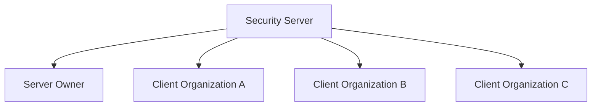
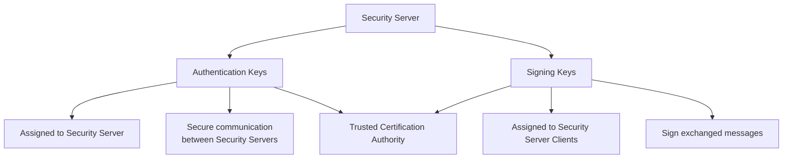
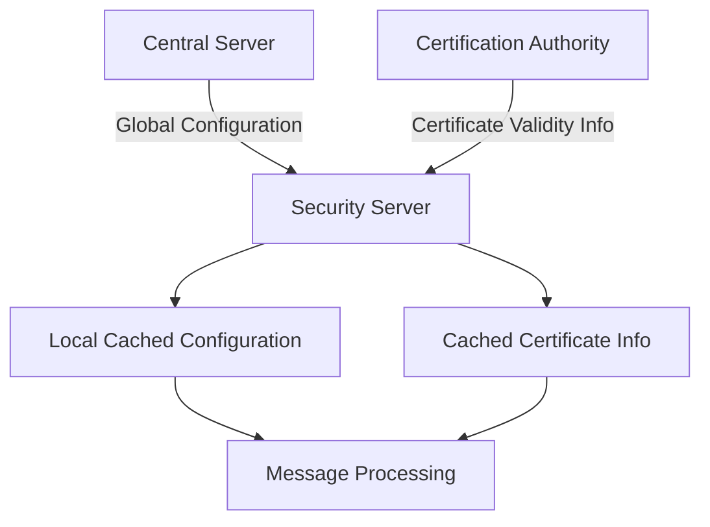
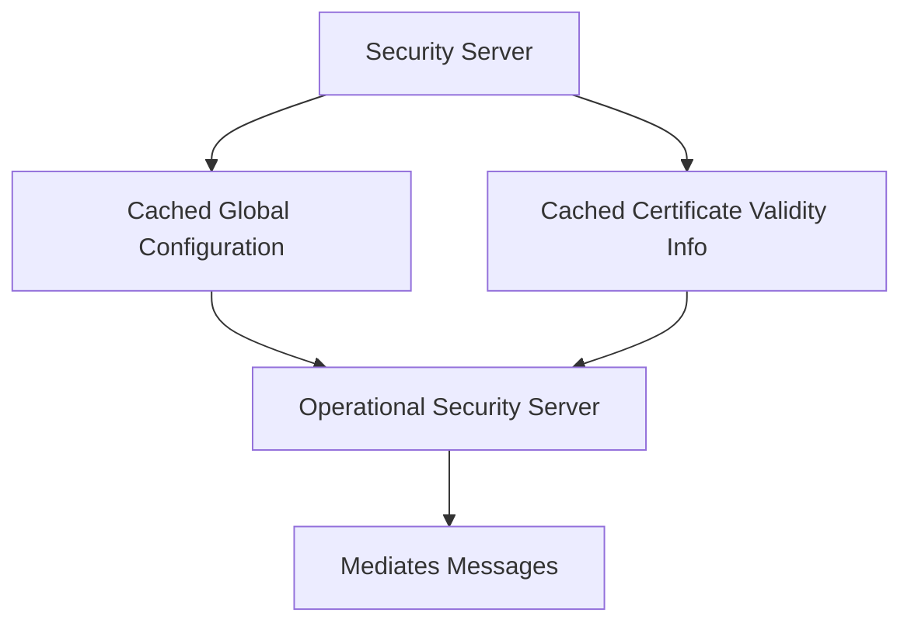
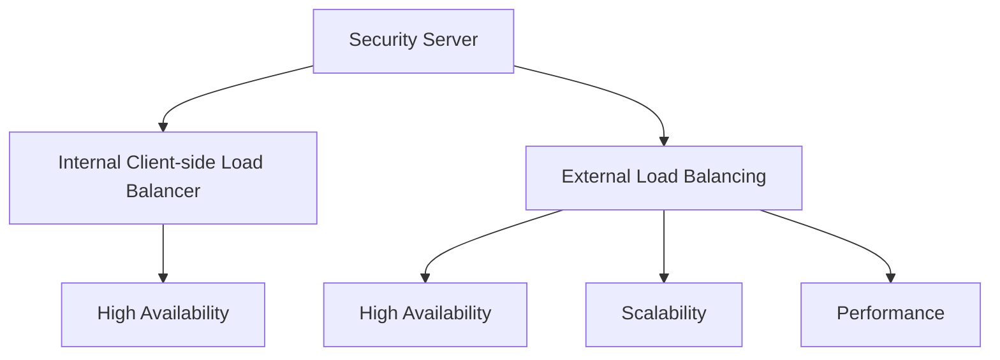
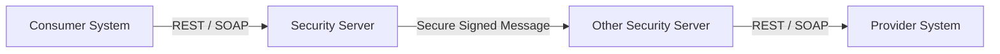

2026-06-22 16:42

Status: #adult

Tags: [[x-road]]
- - -
# Security Server / [[X Road - Server de Segurança]]

Security Server is the entry point to X-Road, and it is required for both producing and consuming services via X-Road. The Security Server mediates service calls and service responses between Information Systems. The Security Server encapsulates the security aspects of the X-Road infrastructure: managing keys for signing and authentication, sending messages over a secure channel, creating the proof value for messages with digital signatures, time-stamping and logging. For a service consumer and a service provider Information System, the Security Server offers a REST-based and a SOAP-based message protocol. The protocol is the same for both the client and the service provider, making the Security Server transparent to the applications.

A single Security Server can host several organizations (multi-tenancy). The organization managing the Security Server is the server owner, and the hosted organizations are Security Server clients.

The Security Server manages two types of keys. The authentication keys are assigned to a Security Server and used for establishing cryptograpdhically secure communication channels with other Security Servers. The signing keys are assigned to the Security Server's clients and used for signing the exchanged messages. A trusted certification authority issues certificates for the keys. Certificates issued by other certification authorities are considered invalid. 

To be able to mediate messages, the Security Server must have a valid copy of the global configuration available all the time. The Security Server downloads the global configuration from the Central Server regularly and uses a local copy while processing messages. The Security Server remains operational as long as it has a valid copy of the global configuration available locally. Similarly, certificate validity information is downloaded from the Certificate Authority and cached locally. Caching allows the Security Server to operate even when the configuration data sources are unavailable.

The Security Server has an internal client-side load balancer, and it also supports external load balancing. The client-side load balancer is a built-in feature, and it provides high availability. Instead, external load balancing provides both high availability and scalability from a performance point of view.

- - -
## Security Server — Visão geral

---

## Security Server — Funções

---

## Fluxo de chamada

---

## Multi-tenancy

---

## Tipos de chaves

---

## Configuração global

---

## Cache local

---

## Load balancing

---

## Resumo final

- - -
# Referências
https://x-road.thinkific.com/courses/take/x-road-service-developer/texts/23560180-architecture