2026-06-22 16:54

Status: #adult 

Tags: [[x-road]]
- - -
# Time-Stamping Authority (TSA) / [[X Road - Autoridade de Registro de Tempo (TSA)]]

All the messages sent via X-Road are time-stamped and logged by the Security Server. The purpose of the time-stamping is to certify the existence of data items at a certain point in time. The TSA provides a time-stamping service that the Security Server uses for time-stamping all the incoming/outgoing requests/responses. Only trusted TSAs that are defined in the Central Server can be used.

The time-stamping authority must implement the time-stamping protocol supported by X-Road. X-Road uses batch time-stamping, which reduces the load of the time-stamping service. The load does not depend on the number of messages exchanged over the X-Road. Instead, it depends on the number of Security Servers in the system.

- - -
## Time-Stamping Authority — Visão geral

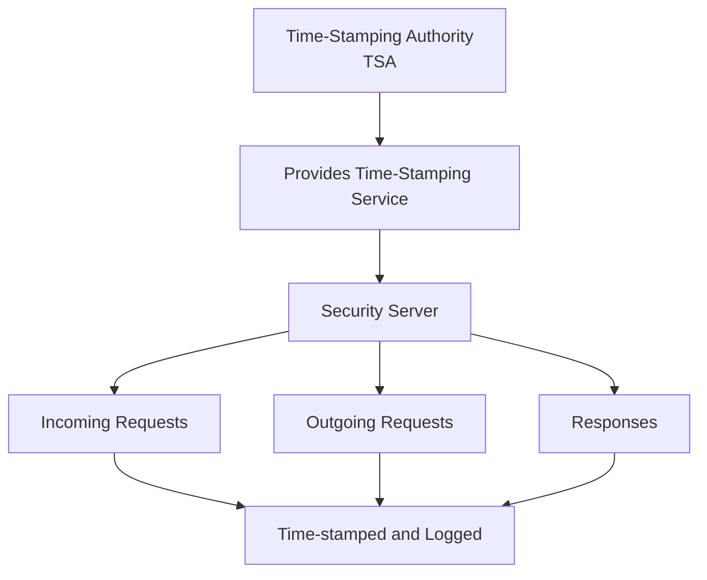

---

## Papel da TSA no X-Road

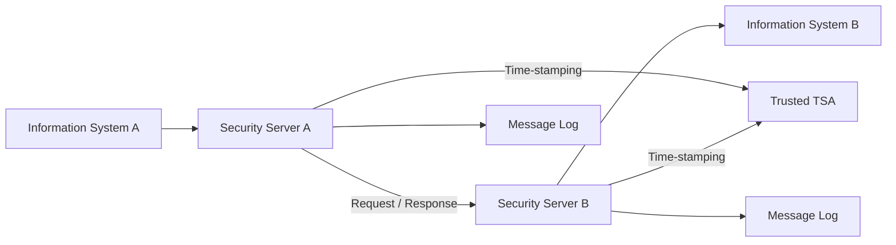

---

## Certificação da existência dos dados

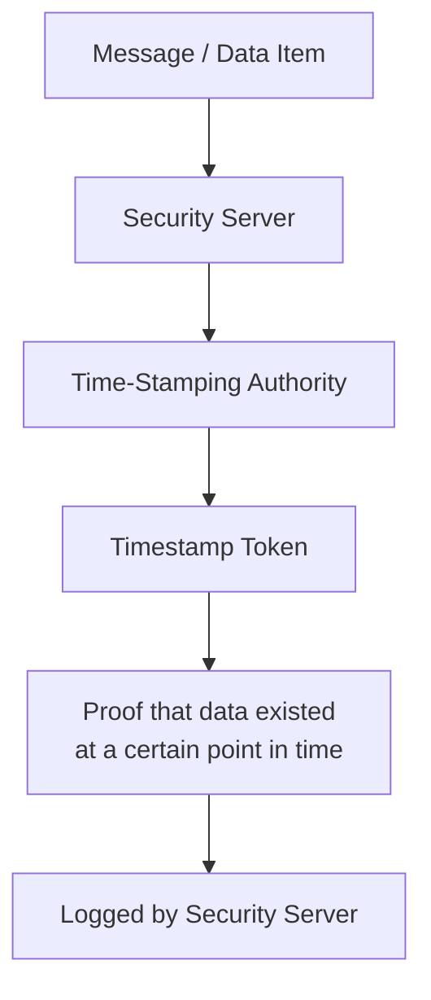

---

## Apenas TSAs confiáveis

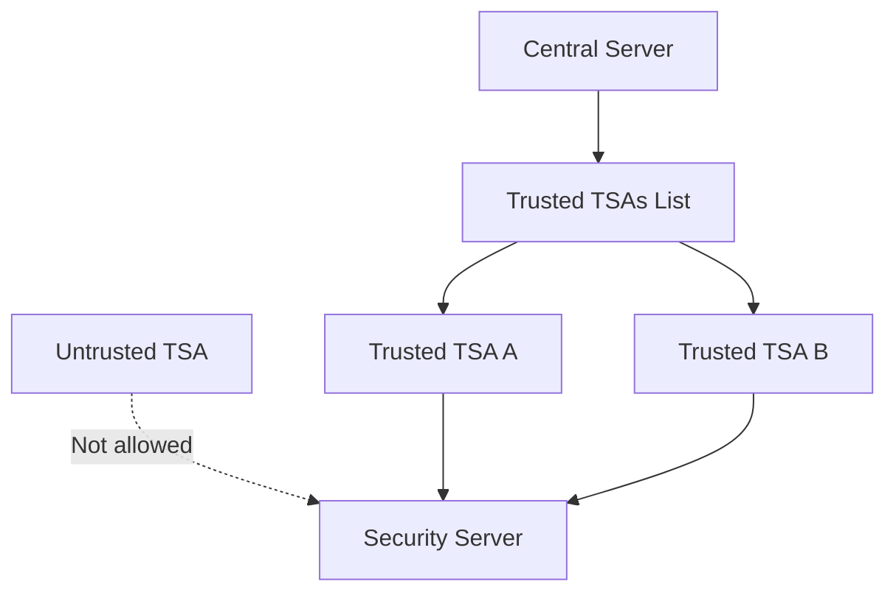

---

## TSA definida no Central Server

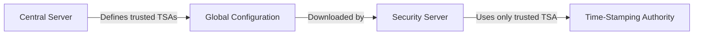

---

## Fluxo de time-stamping

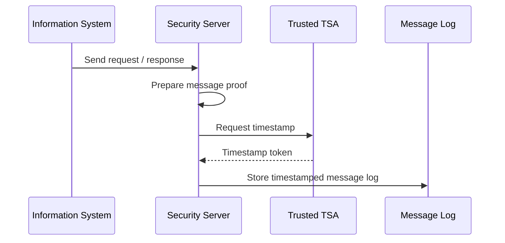

---

## Time-stamping em mensagens de entrada e saída

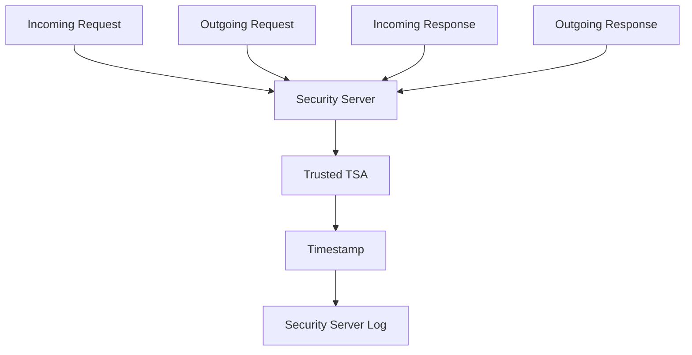

---

## Batch time-stamping

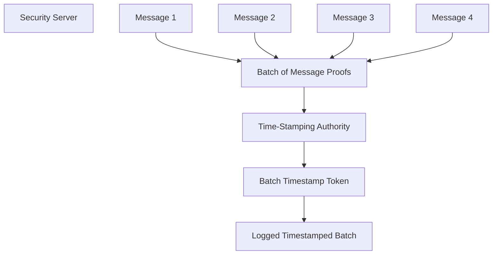

---

## Redução de carga com batch time-stamping

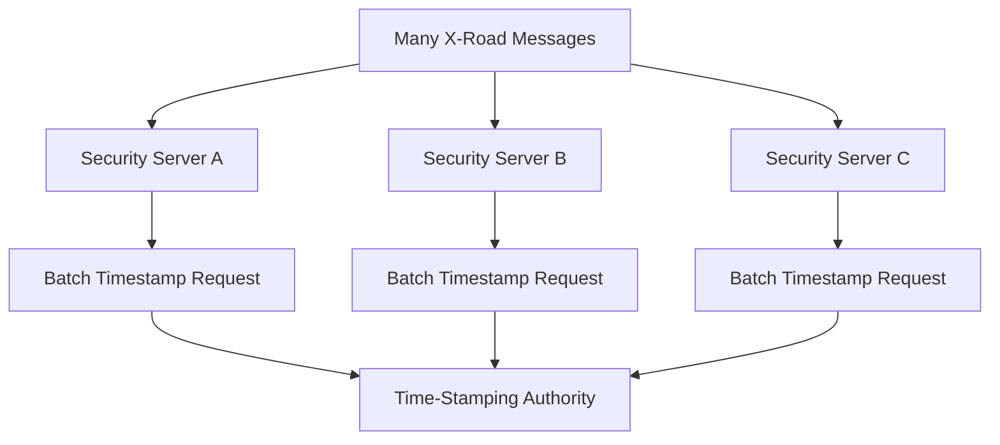

---

## Carga depende dos Security Servers

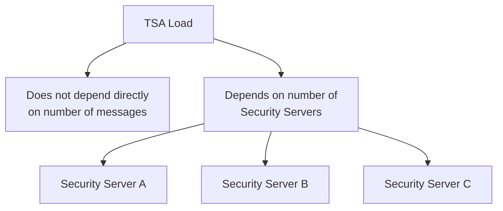

---

## Resumo visual

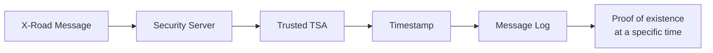

- - -
# Referências
https://x-road.thinkific.com/courses/take/x-road-service-developer/texts/23560180-architecture